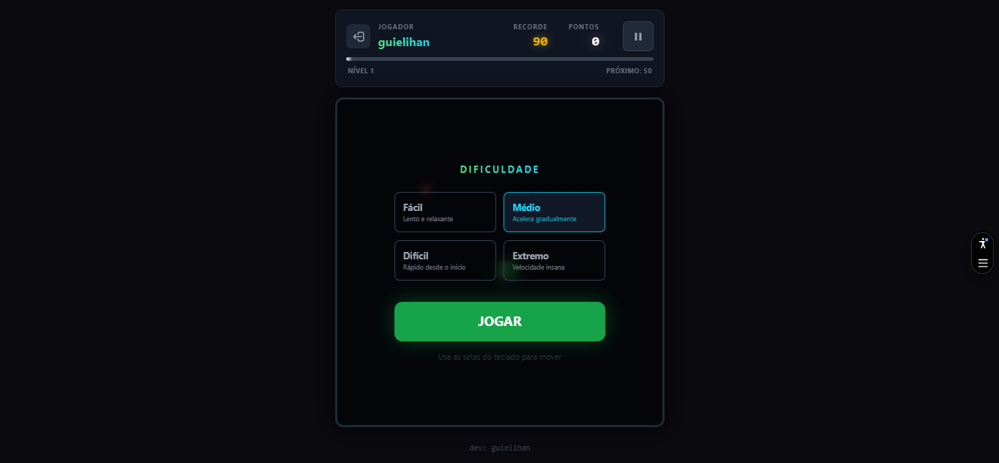
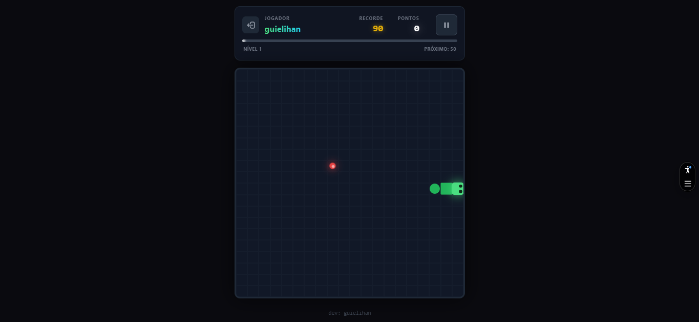
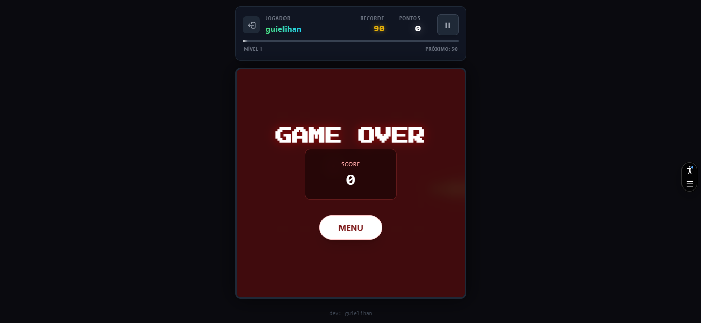
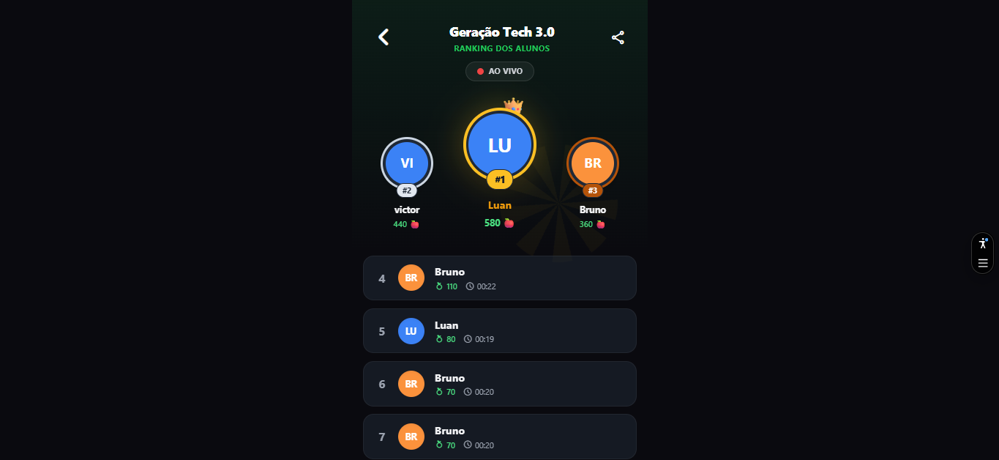

# Snake Geração Tech 🐍

Jogo da cobrinha interativo feito para os colegas de turma do Geração Tech.

## 📸 Preview

### Tela de Login

*Tela inicial com formulário de login onde os jogadores inserem apelido, idade e gênero.*

### Seleção de Dificuldade

*Tela de escolha de dificuldade com quatro opções: Fácil, Médio, Difícil e Extremo.*

### Jogo em Ação

*Interface do jogo mostrando a cobrinha, a comida (maçã) e o sistema de pontuação em tempo real.*

### Tela de Game Over

*Tela exibida ao fim da partida mostrando o score final e opção de retornar ao menu.*

### Ranking de Jogadores

*Ranking ao vivo mostrando os top jogadores com suas pontuações e a opção de compartilhar via WhatsApp.*

## 🚀 Run Locally

**Prerequisites:** Node.js

1. Install dependencies:
   ```bash
   npm install
   ```
2. Set the `VITE_GEMINI_API_KEY` in `.env.local` to your Gemini API key
3. Run the app:
   ```bash
   npm run dev
   ```

> 📖 **Para instruções detalhadas e solução de problemas**, consulte o [Guia de Início Rápido](./GUIA_INICIO.md)

## 🎮 Features

- Jogo Snake clássico com múltiplas dificuldades
- Sistema de ranking local
- Integração com Gemini AI para títulos e comentários
- Tema claro/escuro
- Design responsivo para mobile e desktop
- Efeitos visuais e sonoros

## 🛠️ Tecnologias Utilizadas

Este projeto foi desenvolvido com as seguintes tecnologias:

### Frontend
- **HTML5** - Estrutura semântica da aplicação
- **TypeScript** - Linguagem de programação com tipagem estática
- **React 19** - Biblioteca para construção de interfaces de usuário
- **Tailwind CSS** - Framework CSS utilitário para design responsivo

### Backend & Build
- **Node.js** - Ambiente de execução JavaScript
- **Vite** - Bundler e ferramenta de desenvolvimento rápida

### Integrações
- **Google Gemini AI** - Integração com IA para geração de conteúdo
- **Vercel KV** - Armazenamento de dados para ranking global

### Ferramentas
- **Material Symbols** - Ícones modernos
- **Google Fonts** - Fontes personalizadas (Press Start 2P, Inter)